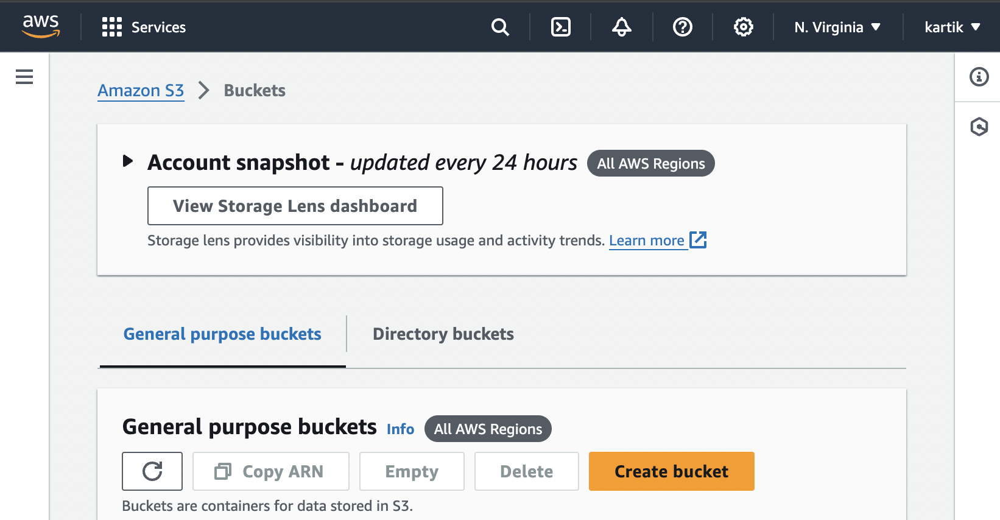

# 🚀 Deploying a Static Website on AWS S3

In this guide, you'll learn how to deploy a static website on AWS S3 step-by-step. Let's get started! 🎉

## Table of Contents

1. [Create an S3 Bucket](#1-create-an-s3-bucket)
2. [Upload Website Content](#2-upload-website-content)
3. [Configure Bucket for Website Hosting](#3-configure-bucket-for-website-hosting)
4. [Set Permissions](#4-set-permissions)
5. [Test Your Website](#5-test-your-website)

---

## 1. Create an S3 Bucket 🪣

### Step 1: Go to the AWS Management Console

- Head over to the [AWS S3 Console](https://console.aws.amazon.com/s3/).
  

- Click **Create bucket**.

### Step 2: Configure the Bucket

- Give your bucket a globally unique name (e.g., `intro-website-hosting`).
  
- Choose the **region** closest to your target audience.
- For `Bucket Versioning` choose `Enable`.
  

- Uncheck **Block all public access** (you'll configure public access later).
  
- Click **Create bucket**.

---

## 2. Upload Website Content 📁

### Step 1: Upload Files

- Select the newly created bucket.
- Click **Upload**.
- Drag and drop your **HTML, CSS, and JS files** or click **Add files**.
  
- Click **Upload**.
- Your files should upload in a few minutes! Choose `Close` when you see the green banner.

---

## 3. Configure Bucket for Website Hosting 🌐

### Step 1: Enable Static Website Hosting

- Go to the **Properties** tab of your bucket.
- Scroll down to the **Static website hosting** section.
  
- Select **Enable**.
- Enter `index.html` as the **Index document** and optionally `error.html` as the **Error document**.
  

- Click **Save**.
  

- Select the checkboxes next to your `index.html` file and the folder of website assets.
- In the `Actions` dropdown, choose `Make public using ACL`.
  

---

## 4. Set Permissions 🔑

### Step 1: Make the Bucket Public

- Go to the **Permissions** tab.
- Scroll to **Bucket Policy**.
- Paste the following policy to allow public read access:

  ```json
  {
    "Version": "2012-10-17",
    "Statement": [
      {
        "Effect": "Allow",
        "Principal": "*",
        "Action": "s3:GetObject",
        "Resource": "arn:aws:s3:::my-awesome-website/*"
      }
    ]
  }
  ```

## Final Preview


